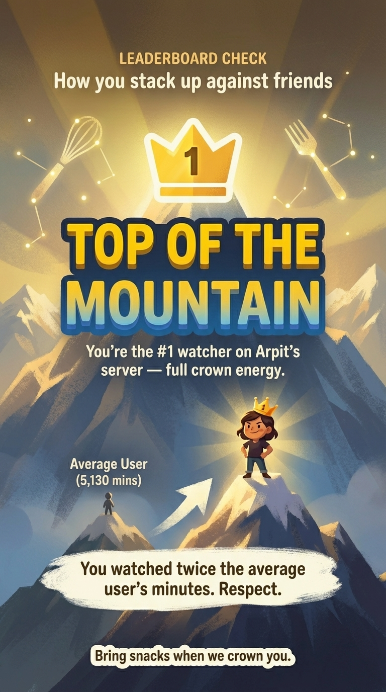
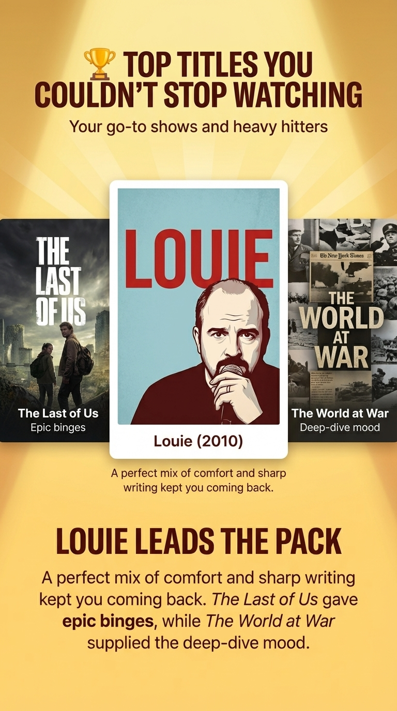
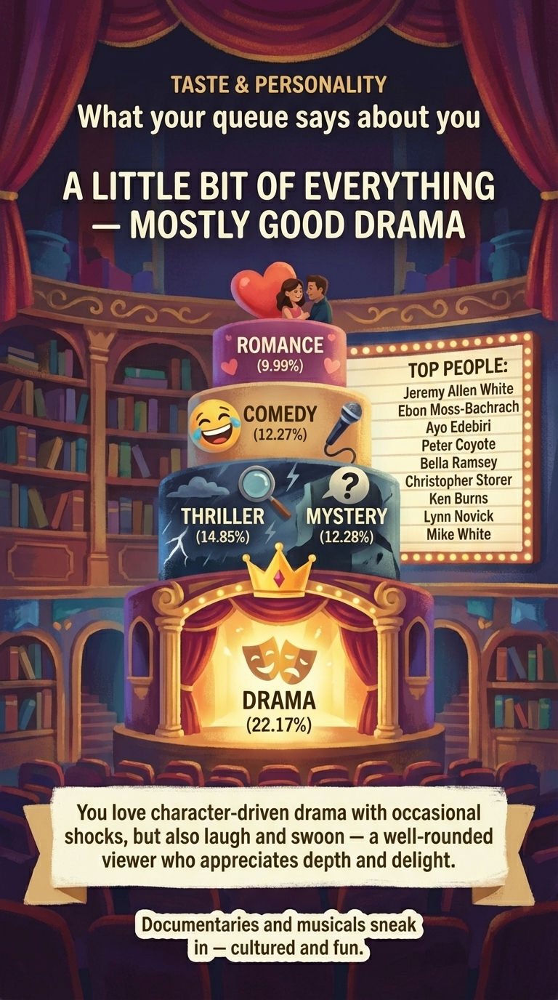
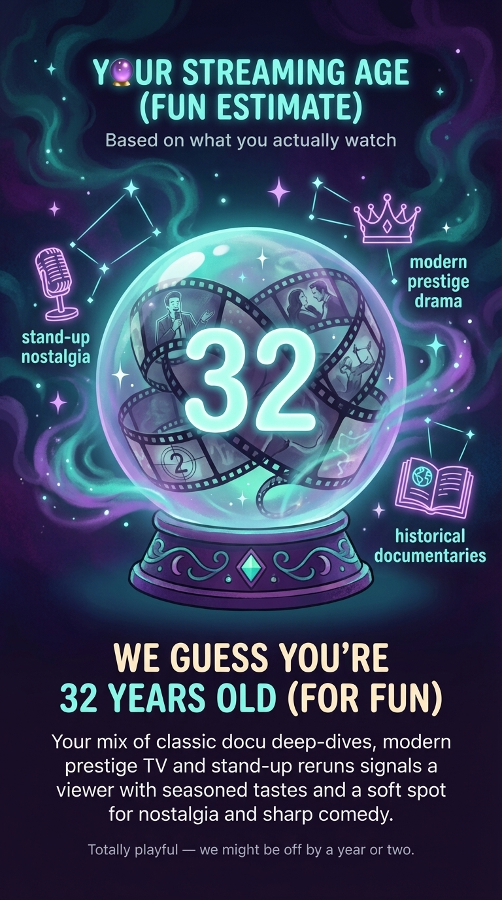

# Plex Wrapped 🎬

> ⚠️ **Disclaimer**: This project was entirely vibe-coded and has plenty of rough edges. Use at your own risk! There may be bugs, unexpected behavior, and things that just don't work quite right. No guarantees, no warranties—just a fun experiment. Proceed with caution and a sense of adventure. 🚀

A personalized year-in-review experience for your Plex server users—think Spotify Wrapped, but for your media library.

<p align="center">
  
  
  
  
</p>

## How It Works

Plex Wrapped uses a three-stage pipeline to create personalized, entertaining wrap experiences:

### 1. 📊 Data Collection

Data is collected from **Plex** and **Tautulli**:

- **Plex**: User accounts, library metadata, media artwork
- **Tautulli**: Watch history, session data, playback statistics

The system analyzes each user's viewing patterns including watch time, binge sessions, genre preferences, device usage, and more.

### 2. 🧠 Insight Generation

Raw data is transformed into meaningful insights:

- **Cross-user rankings**: Compare watch time, episodes, movies, and binge sessions across all users
- **Binge detection**: Automatically identifies marathon viewing sessions
- **Genre analysis**: Calculates top genres with percentages
- **Pattern recognition**: Discovers seasonal trends, repeat watches, device preferences
- **Personalized stats**: Daily averages, longest sessions, most-watched actors/directors

### 3. 🤖 AI-Powered Content

An LLM (OpenAI GPT) transforms dry statistics into fun, engaging narratives:

- **Cohesive storytelling**: Cards build progressively from basic stats to deeper insights
- **Humorous commentary**: Witty, teasing descriptions that make stats memorable
- **Personalized context**: Uses cross-user comparisons ("You're #1!", "The night owl of the group!")
- **Progressive reveal**: Swipable cards that unfold your viewing story

### 4. 🎨 AI Image Generation (Optional)

For a premium visual experience, each card can be rendered as a unique AI-generated image using Google's **Nano Banana Pro** model:

- Creates visually stunning, personalized card images
- Supports high-resolution outputs with enhanced text rendering
- Falls back to traditional UI if disabled or unavailable

> ⚠️ **Cost Warning**: Image generation can get expensive at scale. Each card requires an API call. Consider enabling only for special occasions or key users.

## Features

- 📊 **Comprehensive Analytics**: Detailed statistics from your Plex viewing history
- 🎯 **Deep Insights**: Beyond basic stats—discover binge streaks, genre preferences, viewing patterns
- 🎨 **Beautiful UI**: Modern, swipable cards inspired by Spotify Wrapped
- 👥 **Multi-User Support**: Generate wraps for all users on your Plex server
- 🤖 **AI-Powered Cards**: LLM-generated cohesive, funny, personalized narratives
- 📈 **Cross-User Rankings**: See how you stack up against other viewers
- 🖼️ **AI Images**: Optional AI-generated card visuals (Nano Banana Pro)

## Quick Start

### Prerequisites

- Python 3.9+
- Node.js 16+ (for local development)
- Docker and Docker Compose (recommended)
- Access to Plex server
- Tautulli instance

### 1. Configure

```bash
cp config.yaml.example config.yaml
```

Edit `config.yaml`:

```yaml
tautulli:
  url: http://your-tautulli-server:8181
  api_key: YOUR_TAUTULLI_API_KEY

# OpenAI for fun, engaging card text (recommended)
openai:
  api_key: YOUR_OPENAI_API_KEY
  enabled: true

# Optional: AI-generated card images (can be expensive)
image_generation:
  api_key: YOUR_GOOGLE_AI_API_KEY
  enabled: false

# Optional: Custom date range
time_range:
  start_date: 2024-01-01
  end_date: 2024-12-31

# Optional: Map usernames to friendly display names
name_mappings:
  johndoe123: John
  janedoe456: Jane

# Optional: Add custom context for AI-generated content
# This is injected into the AI prompt to personalize the tone
custom_prompt_context: "This is a family server - keep it fun and friendly!"
```

### 2. Run with Docker (Recommended)

```bash
# Start containers
docker-compose up -d

# Generate wraps
docker-compose exec backend python pregenerate.py

# View at http://localhost:8765
```

### 3. Share Wraps

After generation, shareable links are printed to the console:

```
http://yourserver:8765/w/{token}
```

Each user gets a unique token. Tokens are stored in `data/tokens.json`.

## Getting API Keys

| Service          | Where to Get                                                                                                  |
| ---------------- | ------------------------------------------------------------------------------------------------------------- |
| **Plex Token**   | [Plex token finder](https://support.plex.tv/articles/204059436-finding-an-authentication-token-x-plex-token/) |
| **Tautulli API** | Tautulli → Settings → Web Interface → API                                                                     |
| **OpenAI API**   | [platform.openai.com](https://platform.openai.com/api-keys)                                                   |
| **Google AI**    | [aistudio.google.com](https://aistudio.google.com/) (for image generation)                                    |

## Generating Wraps

The `pregenerate.py` script handles the entire pipeline:

```bash
# Full generation (data + LLM cards)
python pregenerate.py

# Force regenerate all
python pregenerate.py --force

# Data collection only (skip LLM, useful for testing)
python pregenerate.py --data-only

# Single user
python pregenerate.py <username>
```

### Output Files

- `wraps/` — Final wrap JSON files (served to frontend)
- `wraps_data/` — Raw data and cross-user insights
- `generated_images/` — AI-generated card images (if enabled)
- `data/tokens.json` — Token mappings for shareable links

## Image Generation Details

When `image_generation.enabled: true`, the system uses Google's **Nano Banana Pro** model to create unique visuals for each card.

### How It Works

1. **After LLM generates card text**, each card is sent to Nano Banana Pro
2. **Images are generated** based on the card's data and narrative
3. **Saved to** `generated_images/{username}/card_{index}.png`
4. **Frontend displays** the image instead of UI components (with fallback)

### Technical Details

The integration uses the `google-genai` SDK:

```python
from google import genai
from google.genai import types

client = genai.Client(api_key="YOUR_API_KEY")
response = client.models.generate_content(
    model="gemini-3-pro-image-preview",  # Nano Banana Pro
    contents="Your prompt here",
    config=types.GenerateContentConfig(response_modalities=["IMAGE"])
)
```

### Fallback Behavior

- If image generation fails → falls back to traditional UI
- If disabled → uses standard card UI
- If image fails to load → shows UI instead

## Local Development

```bash
# Install backend
pip install -r requirements.txt

# Install frontend
cd frontend && npm install

# Run backend (terminal 1)
python -m uvicorn main:app --reload

# Run frontend (terminal 2)
cd frontend && npm start
```

Or use the startup script:

```bash
./start.sh
```

- Frontend: http://localhost:8765
- Backend API: http://localhost:8766

## Docker Commands

```bash
# Start
docker-compose up -d

# View logs
docker-compose logs -f

# Regenerate wraps
docker-compose exec backend python pregenerate.py

# Rebuild after changes
docker-compose up -d --build

# Stop
docker-compose down
```

> **Note**: If Plex/Tautulli run on the host machine, use `host.docker.internal` instead of `localhost` in config.

## API Endpoints

| Endpoint                               | Description                 |
| -------------------------------------- | --------------------------- |
| `GET /api/users`                       | List all Plex users         |
| `GET /api/wrap/{username}`             | Get wrap for user           |
| `GET /api/wrap-by-token/{token}`       | Get wrap by shareable token |
| `GET /api/token/{username}`            | Get token for username      |
| `GET /api/generated-image?path={path}` | Serve generated image       |
| `GET /api/health`                      | Health check                |

## Troubleshooting

### Common Issues

| Issue                     | Solution                                               |
| ------------------------- | ------------------------------------------------------ |
| "User not found"          | Ensure username matches exactly as in Tautulli         |
| Empty data                | Check date range in config includes actual watch dates |
| "Failed to connect"       | Verify Plex/Tautulli are accessible                    |
| Background images missing | Check browser console, verify API URL                  |
| Token invalid             | Regenerate wraps: `python pregenerate.py`              |

### Docker-Specific

- Services on host? Use `host.docker.internal` in config
- Port conflicts? Check 8765/8766 availability
- After code changes: `docker-compose up -d --build`

### Debug Token Issues

```bash
# Check token exists
cat data/tokens.json

# Test API
curl http://localhost:8766/api/health
curl http://localhost:8766/api/wrap-by-token/YOUR_TOKEN
```

## Tips

- **Date Range**: Default is last year. Customize in `time_range` config
- **LLM Quality**: OpenAI GPT creates much more engaging cards than raw data
- **Image Generation**: Enable sparingly—it adds significant cost but creates stunning visuals
- **Pre-generate**: Always pre-generate wraps for best performance

## License

MIT
